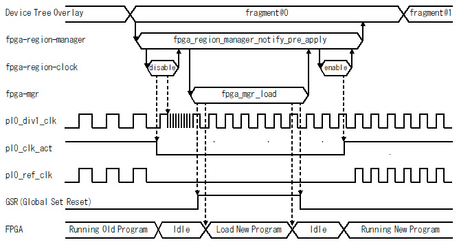

fpga-region-manager
==================================================================================

# Overview

## Introduction of fpga-region-manager

fpga-region-manager is a Linux Kernel module for programming FPGA while safely changing the clock frequency.



Fig.1 fpga-region-manager operation

## Supported platforms

* OS : Linux Kernel Version 5.4 (with CONFIG_FPGA_REGION=y and CONFIG_OF_FPGA_REGION=y)
* CPU: ARM64 Cortex-A53 (Xilinx ZYNQ UltraScale+ MPSoC)

## Changes from original

fpga-region-manager is a minor modification of fpga_region, fpga_bridge and of_fpga_region included in the mainline of the Linux Kernel.
The names have been changed as follows to prevent name collisions within the Linux Kernel.

| original name       | renamed                |
|:--------------------|:-----------------------|
| fpga_region         | fpga_region_core       |
| fpga_bridge         | fpga_region_interface  |
| of_fpga_region      | fpga_region_manager    |

Perhaps in the future these fixes may be introduced into the Linux Kernel mainline.

fpga_region_interface has the following additional changes from fpga_brdige.

  * add of_setup() to fpga_region_interface_ops.
  * fpga_region_interfaces_disable() performs the reverse order of fpga_region_interfaces_enable().
  * if a name is specified when the device create, that name is set to the device name.
  * add interface at the tail of interface_list when adding interface.

fpga_region_core has the following additional changes from fpga_region.

  * fpga_region_interface is used instead of fpga_bridge.

fpga_region_manager has the following additional changes from of_fpga_region.

  * fpga_region_core is used instead of fpga_region.
  * of_setup() of fpga-region-interface is called, when fpga_region_manager_get_interfaces() is executed.

# Usage

## Compile Kernal Modules

```console
shell$ cd fpga-region-manager
shell$ export ARCH=arm64
shell$ export KERNEL_SRC_DIR=/home/fpga/work/ZynqMP-FPGA-Linux/linux-xlnx-v2020.1-zynqmp-fpga
shell$ make
```

## Install Kernel Modules

```console
shell$ sudo insmod fpga-region-interface.ko
shell$ sudo insmod fpga-region-core.ko
shell$ sudo insmod fpga-region-manager.ko
shell$ sudo insmod fpga-region-clock.ko
```

## Configuration via the device tree file

Before programming the FPGA with fpga-region-manager, prepare the following device tree and load the kernel module in advance.

```devicetree:fpga-top-region.dts
/dts-v1/; /plugin/;
/ {
	fragment@0 {
		target-path = "/";
		__overlay__ {
			fpga_clk0: fpga-clk0 {
				compatible    = "ikwzm,fpga-region-clock";
				device-name   = "fpga-clk0";
				clocks        = <&zynqmp_clk 0x47 &zynqmp_clk 0 &zynqmp_clk 1 &zynqmp_clk 8>;
				insert-rate   = <100000000>;
				insert-enable = <0>;
				remove-enable = <0>;
			};
			fpga_clk1: fpga-clk1 {
				compatible    = "ikwzm,fpga-region-clock";
				device-name   = "fpga-clk1";
				clocks        = <&zynqmp_clk 0x48 &zynqmp_clk 0 &zynqmp_clk 1 &zynqmp_clk 8>;
				insert-enable = <0>;
				remove-enable = <0>;
			};
			fpga_clk2: fpga-clk2 {
				compatible    = "ikwzm,fpga-region-clock";
				device-name   = "fpga-clk2";
				clocks        = <&zynqmp_clk 0x49 &zynqmp_clk 0 &zynqmp_clk 1 &zynqmp_clk 8>;
				insert-enable = <0>;
				remove-enable = <0>;
			};
			fpga_clk3: fpga-clk3 {
				compatible    = "ikwzm,fpga-region-clock";
				device-name   = "fpga-clk3";
				clocks        = <&zynqmp_clk 0x4a &zynqmp_clk 0 &zynqmp_clk 1 &zynqmp_clk 8>;
				insert-enable = <0>;
				remove-enable = <0>;
			};
			fpga_top_region: fpga-top-region {
				compatible    = "ikwzm,fpga-region-manager";
				fpga-bridges  = <&fpga_clk0 &fpga_clk1 &fpga_clk2 &fpga_clk3>;
				fpga-mgr      = <&zynqmp_pcap>;
			};
		};
        };
};
```

## FPGA programming with fpga-region-manager

For example, if you programmed fpga-clk0 to 250MHz and programmed example1.bin into the FPGA,
you would have a device tree such as:

```devicetree:example1.dts
/dts-v1/; /plugin/;
/ {
	fragment@0 {
		target-path = "/fpga-top-region";
		__overlay__ {
			firmware-name = "examlpe1.bin";
			fpga-clk0 {
				region-rate     = <250000000>;
				region-enable   = <1>;
				region-resource = <0>;
			};
		};
        };
};
```

